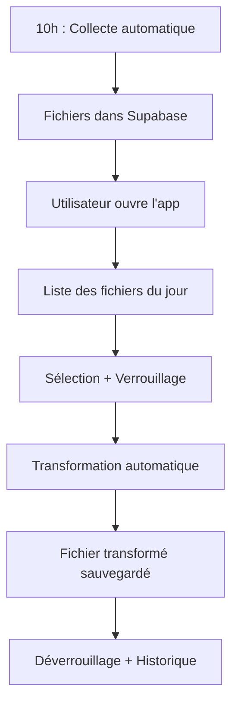

# 📋 Récapitulatif du projet - Gestionnaire de Commandes Fournisseurs

## ✅ Ce qui a été créé

Votre application complète de gestion de commandes fournisseurs est maintenant prête !

### 📦 Architecture complète

```
supplier-order-manager/
│
├── 📱 APPLICATION DESKTOP (PySide6/Qt)
│   ├── app/main.py                    ✅ Point d'entrée
│   ├── app/ui/main_window.py          ✅ Interface principale
│   ├── app/ui/login_dialog.py         ✅ Écran de connexion
│   ├── app/services/supabase_client.py ✅ Client API Supabase
│   ├── app/services/file_processor.py  ✅ Moteur de transformation
│   └── app/models/file_record.py       ✅ Modèles de données
│
├── 🤖 WORKER DE COLLECTE AUTOMATIQUE
│   ├── worker/collector.py             ✅ Orchestrateur principal
│   ├── worker/email_fetcher.py         ✅ Collecte IMAP/Exchange
│   ├── worker/ftp_fetcher.py           ✅ Collecte FTP/SFTP
│   └── worker/setup_scheduler.bat      ✅ Config tâche Windows
│
├── ⚙️ CONFIGURATION
│   ├── config/supabase_schema.sql      ✅ Schéma base de données
│   ├── config/suppliers.json           ✅ Configuration fournisseurs
│   ├── config/transformations.json     ✅ Règles de transformation
│   ├── .env.example                    ✅ Template configuration
│   └── requirements.txt                ✅ Dépendances Python
│
├── 📚 DOCUMENTATION
│   ├── README.md                       ✅ Documentation principale
│   ├── INSTALLATION.md                 ✅ Guide d'installation
│   ├── USAGE.md                        ✅ Guide d'utilisation
│   └── TRANSFORMATIONS_GUIDE.md        ✅ Guide des transformations
│
└── 🚀 UTILITAIRES
    ├── start_app.bat                   ✅ Lancement rapide
    └── .gitignore                      ✅ Exclusions Git
```

## 🎯 Fonctionnalités implémentées

### ✅ Collecte automatique
- [x] Récupération depuis emails (IMAP)
- [x] Récupération depuis Exchange
- [x] Récupération depuis FTP/SFTP
- [x] Planification automatique (10h quotidien)
- [x] Support de 15 fournisseurs simultanés
- [x] Gestion des patterns de fichiers

### ✅ Interface collaborative
- [x] Authentification Supabase
- [x] Liste des fichiers avec filtres
- [x] Système de verrouillage collaboratif
- [x] Synchronisation temps réel (30s)
- [x] Statuts visuels (À traiter, En cours, Terminé, Erreur)
- [x] Indicateurs de qui travaille sur quoi

### ✅ Transformation de fichiers
- [x] Support CSV, XLSX, XLS
- [x] Renommage de colonnes (column_mapping)
- [x] Ajout de colonnes (columns_to_add)
- [x] Suppression de colonnes (columns_to_remove)
- [x] Formatage des valeurs (format_rules)
- [x] Règles personnalisables par fournisseur

### ✅ Gestion avancée
- [x] Historique complet des traitements
- [x] Traçabilité (qui, quand, quoi)
- [x] Import manuel de fichiers
- [x] Regroupement de fichiers multi-jours
- [x] Logs détaillés (app + worker)

### ✅ Stockage et base de données
- [x] Supabase PostgreSQL (métadonnées)
- [x] Supabase Storage (fichiers)
- [x] RLS (Row Level Security)
- [x] Versioning automatique
- [x] Sauvegardes Supabase

## 📊 Schéma de la base de données

### Tables créées

1. **profiles** - Profils utilisateurs
   - Extend Supabase Auth
   - Informations des collaborateurs

2. **suppliers** - Fournisseurs
   - Configuration par fournisseur
   - Règles de collecte et transformation

3. **files** - Fichiers reçus
   - Métadonnées complètes
   - Système de verrouillage
   - Traçabilité des traitements

4. **processing_history** - Historique
   - Toutes les actions effectuées
   - Logs détaillés
   - Audit trail complet

5. **file_merges** - Regroupements
   - Fusion de fichiers multi-jours
   - Tracking des sources

### Storage Buckets

- **supplier-files-original** : Fichiers bruts reçus
- **supplier-files-transformed** : Fichiers transformés

## 🔐 Sécurité implémentée

- ✅ Authentification Supabase obligatoire
- ✅ Mots de passe dans `.env` (non versionnés)
- ✅ RLS Policies sur toutes les tables
- ✅ Logs d'audit complets
- ✅ Verrous automatiques (30 min timeout)
- ✅ `.gitignore` pour données sensibles

## 📈 Scalabilité

### Actuellement configuré pour :
- 2 postes utilisateurs Windows
- 15 fournisseurs
- ~15 fichiers par jour
- Rétention logs : 30 jours

### Peut facilement évoluer vers :
- ✅ Plus d'utilisateurs (ajouter dans Supabase Auth)
- ✅ Plus de fournisseurs (ajouter dans `suppliers.json`)
- ✅ Plus de volume (Supabase Pro supporté)
- ✅ Multi-sites (cloud Supabase)

## 🔄 Workflow complet



## 📝 Prochaines étapes pour vous

### 1. Installation (1-2h)

Suivez [INSTALLATION.md](INSTALLATION.md) :
- [ ] Installer Python
- [ ] Configurer Supabase
- [ ] Créer le fichier `.env`
- [ ] Tester l'application

### 2. Configuration des fournisseurs (2-3h)

Pour chacun de vos 15 fournisseurs :
- [ ] Ajouter dans `config/suppliers.json`
- [ ] Configurer les règles de transformation
- [ ] Tester avec un fichier exemple

### 3. Déploiement (30 min)

- [ ] Installer sur le 1er poste
- [ ] Configurer la tâche planifiée
- [ ] Installer sur le 2ème poste
- [ ] Former les utilisateurs

### 4. Mise en production (1 jour)

- [ ] Tester pendant 1 journée complète
- [ ] Vérifier que tous les fichiers arrivent
- [ ] Ajuster les transformations si nécessaire
- [ ] Valider avec l'équipe

## 🎓 Ressources de documentation

| Document | Usage | Audience |
|----------|-------|----------|
| [README.md](README.md) | Vue d'ensemble et référence | Tout le monde |
| [INSTALLATION.md](INSTALLATION.md) | Installation pas à pas | Administrateur |
| [USAGE.md](USAGE.md) | Utilisation quotidienne | Utilisateurs |
| [TRANSFORMATIONS_GUIDE.md](TRANSFORMATIONS_GUIDE.md) | Config transformations | Administrateur |

## 🛠️ Technologies utilisées

| Composant | Technologie | Version |
|-----------|-------------|---------|
| **Langage** | Python | 3.9+ |
| **Interface** | PySide6 (Qt) | 6.8.1 |
| **Backend** | Supabase | Pro |
| **Base de données** | PostgreSQL | 15+ |
| **Storage** | Supabase Storage | Cloud |
| **Traitement données** | Pandas | 2.2.0 |
| **Emails** | imaplib / exchangelib | - |
| **FTP** | Paramiko (SFTP) | 3.4.0 |
| **Logs** | Loguru | 0.7.2 |

## 💾 Structure des données

### Format uniforme recommandé

Pour tous vos fournisseurs, je recommande de transformer vers ce format standard :

```
product_ref    | description | quantity | unit_price | date_commande
---------------|-------------|----------|------------|---------------
ABC-123        | Produit A   | 10       | 25.50      | 2024-01-15
DEF-456        | Produit B   | 5        | 12.00      | 2024-01-15
```

Adaptez selon vos besoins métiers !

## 📊 Monitoring et logs

### Logs disponibles

```
logs/
├── app_2024-01-15.log           # Application desktop
├── collector_2024-01-15.log     # Collecte automatique
└── ...
```

### Que surveiller quotidiennement

- ✅ Collecte à 10h a réussi
- ✅ Nombre de fichiers = nombre de fournisseurs
- ✅ Aucun fichier en statut "Erreur"
- ✅ Tous les fichiers traités en fin de journée

## 🚀 Améliorations futures possibles

### Court terme (vous pouvez ajouter)
- [ ] Notification email si collecte échoue
- [ ] Export Excel des rapports
- [ ] Envoi automatique aux fournisseurs
- [ ] Dashboard de statistiques

### Moyen terme (avec développement)
- [ ] API REST pour intégrations
- [ ] Application mobile (consultation)
- [ ] Machine Learning pour détecter anomalies
- [ ] Alertes automatiques

## 📞 Support et maintenance

### Auto-support
1. Consultez les guides de documentation
2. Vérifiez les logs dans `logs/`
3. Testez avec le mode debug

### Maintenance préventive
- **Quotidienne** : Vérifier la collecte
- **Hebdomadaire** : Nettoyer fichiers temporaires
- **Mensuelle** : Archiver les logs
- **Trimestrielle** : Backup Supabase

## ✨ Points forts du projet

1. **Architecture professionnelle** : Code modulaire et maintenable
2. **Documentation complète** : 4 guides détaillés
3. **Production-ready** : Logs, erreurs, sécurité
4. **Collaboratif** : Système de verrouillage temps réel
5. **Flexible** : Configuration JSON facile à modifier
6. **Scalable** : Cloud Supabase, peut grandir facilement

## 🎉 Félicitations !

Vous disposez maintenant d'une application complète et professionnelle pour gérer vos commandes fournisseurs.

### Ce qui change pour vous :

**Avant :**
- ❌ Google Drive désordonné
- ❌ Conflits de versions
- ❌ Pas de suivi
- ❌ Travail manuel répétitif
- ❌ Difficile de savoir qui fait quoi

**Maintenant :**
- ✅ Application centralisée
- ✅ Collecte automatique 10h
- ✅ Transformations automatiques
- ✅ Traçabilité complète
- ✅ Collaboration fluide
- ✅ Historique et audit

---

**Prêt à démarrer ?** → Commencez par [INSTALLATION.md](INSTALLATION.md)

**Des questions ?** → Consultez [README.md](README.md)

**Prêt à utiliser ?** → Lisez [USAGE.md](USAGE.md)

---

🚀 **Bon déploiement et bonne utilisation !**
